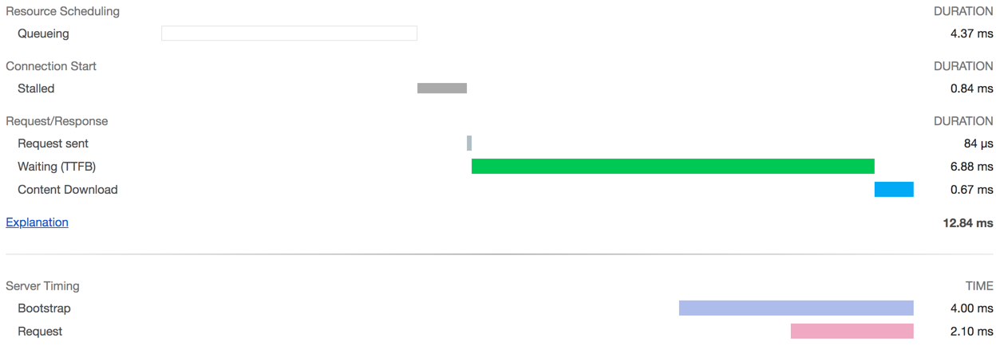

# Server-Timing middleware package

[](https://packagist.org/packages/fetzi/server-timing)
[](https://github.com/fetzi/server-timing/actions)
[](https://github.styleci.io/repos/226304794)
[](https://codeclimate.com/github/fetzi/server-timing/maintainability)

server-timing is a PHP middleware package that adds the `Server-Timing` header to your responses. This information can be viewed in your web browser, for example in Google Chrome.

More information on the `ServerTiming` response header can be found on [MDN docs](https://developer.mozilla.org/en-US/docs/Web/HTTP/Headers/Server-Timing).



The package automatically adds two default metrics but allows you to add custom metrics as well.

## Installation

```
composer require fetzi/server-timing
```

## Setup
The package automatically measures two Timing values in the middleware implementation:

1. `Bootstrap`: The time taken in the application bootstrapping phase
2. `Request`: The total time your request handler(s) needed to process your request

To make sure all timings are as exact as possible it is important to add the middleware at the outermost (last) position of your request handler stack.

### PSR-15 Middleware
To enable the middleware you simply need to add an instance of `Fetzi\ServerTiming\ServerTimingMiddleware` to your middleware stack.

In a [Slim](http://www.slimframework.com/) application you can do this by simply adding

```php
$app->add(new ServerTimingMiddleware($container->get(ServerTimings::class)));
```

to your middleware stack code.

### Laravel Middleware

To enable the middleware in your [Laravel](https://laravel.com/) application you need to use the `Fetzi\ServerTiming\Laravel\ServerTimingMiddleware` class.

If you want to enable the middleware in general simply add the class definition to the `$middleware` array in the `Kernel` class. If you want to enable the middleware only if a condition is met, you need to override the `handle` method of the `Kernel` as demonstrated [here](https://paste.laravel.io/KkeVq).

## Usage

To be able to add your custom server timings you need to make sure that you register the `ServerTimings` class as a singleton in your dependency injection container. This allows you to inject the `ServerTimings` class into any other class and create and measure a custom server timing.

```php
function fetchUsers()
{
    $fetchUsers = $this->serverTimings->create('fetchUsers');
    $fetchUsers->start();
    $users = $this->db->getUsers();
    $fetchUsers->stop();

    return $users;
}
```

This code will generate a new server timing named `fetchUsers` and by calling the `start` and the `stop` method the the execution time is measured.

### Creating a ServerTiming instance
The `ServerTimings` class provides a `create` method to create a `ServerTiming` instance that is automatically registered and will be sent back by the middleware.

```php
// create a ServerTiming with a name
$serverTiming = $serverTimings->create('foo');

// create a ServerTiming with a name and a description
$serverTiming = $serverTimings->create('foo', 'bar');
```

### Measuring a ServerTiming
The `ServerTiming` instance provides two methods for starting and stopping the measurement.

```php
// normal usage
$serverTiming->start();
// ...
$serverTiming->stop();

// set a manual start value (a microtime value as float)
$serverTiming->start(1000000.00);
// ...
$serverTiming->stop();
```

The middleware will make sure to collect all measured ServerTiming instances and append their values in the `Server-Timing` response header.

## License

The MIT License (MIT). Please see the [License File](LICENSE) for more information.
